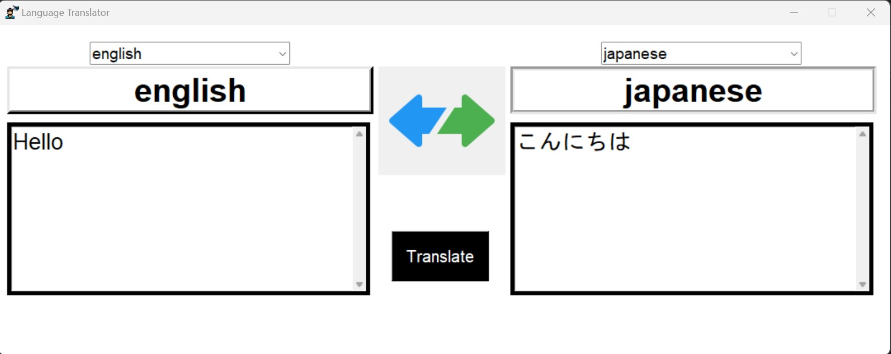

# PyTranslatr

PyTranslatr is a user-friendly language translation application built using Python's Tkinter library. This project enables users to easily translate text between different languages, making communication across linguistic barriers effortless. With an intuitive interface and seamless integration of translation services, PyTranslatr empowers users to efficiently convey their ideas in a globalized world.

## Features

- Select source and target languages from dropdown menus.
- Enter the text you want to translate.
- Click the "Translate" button to obtain the translated text.
- Visualize translation progress and results in real-time.

## Table of Contents

- [Installation](#installation)
- [Usage](#usage)
- [Screenshots](#screenshots)
- [Acknowledgments](#acknowledgments)

## Installation

1. Clone the repository to your local machine:

   ```bash
   git clone https://github.com/MadhanTamilarasan/PyTranslatr.git
   cd PyTranslatr

2. Install the required packages using pip:

   pip install -r requirements.txt 

   If you encounter issues with the Google Translate API, consider using the translate library instead:
   
   pip install translate 

3. Run the application:
    
   python main.py

## Usage
Select the source language and target language from the dropdown menus.
Enter the text you want to translate in the provided text box.
Click the "Translate" button to see the translated text.
Scroll through the translation result using the provided scrollbar.

## Screenshots




## Acknowledgments

Special thanks to the contributors and the open-source community for their valuable contributions and support.

